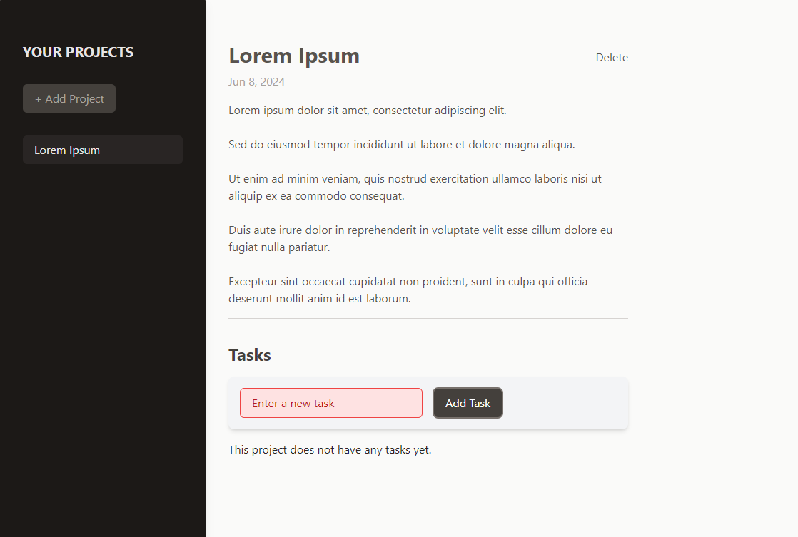

# Project Management App

This is a Project Management Application built as part of the Udemy course
["React - The Complete Guide 2024 (incl. Next.js, Redux)"](https://www.udemy.com/course/react-the-complete-guide-incl-redux/).

## Table of Contents

- [Introduction](#introduction)
- [Features](#features)
- [Technologies Used](#technologies-used)
- [Installation](#installation)
- [Usage](#usage)
- [File Structure](#file-structure)
- [Contributing](#contributing)
- [License](#license)



## Introduction

The Project Management App allows users to create, manage, and organize their
projects and tasks efficiently. This application was developed as part of an
educational exercise in the Udemy course "React - The Complete Guide 2024 (incl.
Next.js, Redux)" to enhance understanding of React, state management, and modern
front-end development practices.

## Features

- Add and delete projects
- Add and delete tasks within projects
- Highlight selected projects
- Responsive design with Tailwind CSS

## Technologies Used

- React
- Tailwind CSS
- JavaScript
- HTML
- CSS

## Installation

### Prerequisites

- Node.js and npm should be installed on your system. You can download them from
  [here](https://nodejs.org/).

### Steps

1. Clone the repository:

   ```bash
   git clone https://github.com/your-username/project-management-app.git
   ```

2. Navigate to the project directory:

   ```bash
   cd project-management-app
   ```

3. Install the dependencies:
   ```bash
   npm install
   ```

## Usage

1. Start the development server:

   ```bash
   npm run dev
   ```

2. Open your browser and navigate to:

   ```
   http://localhost:5173
   ```

3. You should see the Project Management App running. You can now start adding,
   selecting, and managing your projects and tasks.

## File Structure

Here is a high-level overview of the project's file structure:

```
project-management-app
├── public
│   ├── index.html
│   └── favicon.ico
├── src
│   ├── components
│   │   ├── Button.jsx
│   │   ├── NewProject.jsx
│   │   ├── NoProjectSelected.jsx
│   │   ├── ProjectSidebar.jsx
│   │   ├── SelectedProject.jsx
│   │   ├── Tasks.jsx
│   │   └── NewTask.jsx
│   ├── App.jsx
│   ├── index.js
│   └── styles.css
├── package.json
└── README.md
```

## Contributing

Contributions are welcome! Please feel free to submit a Pull Request or open an
issue for any bugs or feature requests.

## License

This project is licensed under the MIT License. See the [LICENSE](LICENSE) file
for details.

---

Feel free to customize this template to better fit your project's needs and
provide more specific details where necessary.
